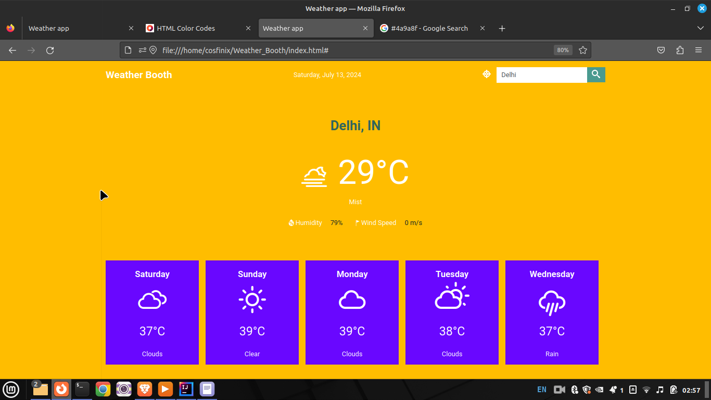

# Weather Booth -  A Weather App

Explore weather conditions worldwide with our intuitive weather app. Powered by the OpenWeatherMap API [Open Weather API](http://api.openweathermap.org), it provides current weather updates and a 5-day forecast for any city on the globe. Stay informed with detailed weather information, including temperature, conditions, and more, all presented in a user-friendly interface. Whether you're planning a trip or staying local, our app ensures you're always prepared with accurate and reliable weather data.

## Screenshot

## Demo
You can view the working demo here: [https://stanulilic.github.io/vanillajs-weatherapp/](https://stanulilic.github.io/vanillajs-weatherapp/)

## Features
-Global Weather Data: Access current weather conditions and forecasts for any city worldwide.
-OpenWeatherMap Integration: Utilizes the OpenWeatherMap API for accurate and up-to-date weather information.
-Current Weather Updates: Provides real-time updates on temperature, humidity, wind speed, and atmospheric pressure.
-5-Day Weather Forecast: Displays a detailed forecast for the next five days, helping users plan ahead.

## Tools/Languages
The following are the languages or tools I used to build the app:

- Html and CSS
- JavaScript(ES6+)
- [Weather icons](https://github.com/erikflowers/weather-icons)
-  [Open Weather API](http://api.openweathermap.org)
